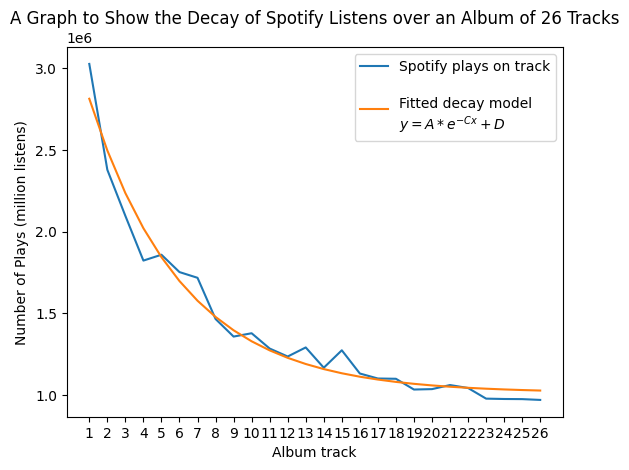

# Listen-Count-Analysis


```
import matplotlib.pyplot as plt
import numpy as np
import scipy as sp
from scipy.optimize import curve_fit

# Create array [1, 2, ..., 26]
# Represents our independent var. x
idepv_x = np.arange(1,27)

# Spotify listens on each track of the album
plays_data = np.array([3028013,2378909,2096193,1822048,
                 1857947,1751530,1716468,1463972,
                 1356065,1376480,1282651,1233807,
                 1289441,1164996,1271989,1129593,
                 1098906,1097275,1031328,1033838,
                 1058806,1040680,975506,973298,
                 972532,967615])
# Show us what this looks like
plt.plot(idepv_x, plays_data, label='Spotify plays on track')

# The exponential decay function
def exp_dec(x, a, c, d):
    return a * np.exp( -c * x ) + d

# Initial guess for numerical method
guess = (4000000, 1, 1)
# Get least-squares fit to data, 
# parameters which we want
optimised_parameters, pcov = curve_fit(exp_dec,
                                idepv_x, plays_data, p0=guess)
# Show us exponential decay graph with found params.
plt.plot(idepv_x, exp_dec(idepv_x,
    optimised_parameters[0], optimised_parameters[1],
    optimised_parameters[2]), label='\nFitted decay model\n$y = A * e^{-Cx}+D$')
plt.title('A Graph to Show the Decay of Spotify Listens over an Album of 26 Tracks')
plt.xlabel('Album track')
plt.ylabel('Number of Plays (million listens)')
plt.xticks(np.arange(1,27, 1))
plt.legend()
plt.show()

print(optimised_parameters)
```